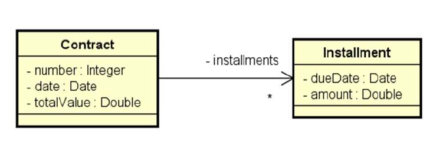
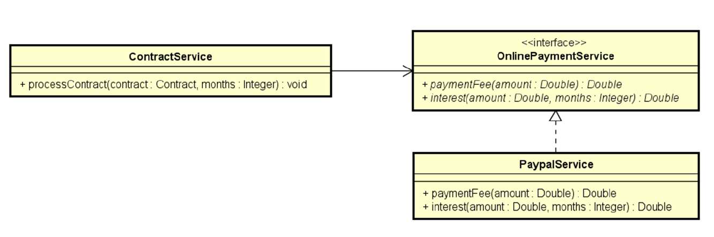

# Contract

Sistema para gerenciamento de parcelas de pagamento com cálculo de juros e taxa de pagamento a partir de um contrato. Utiliza interface para baixo acoplamento da solução e o cálculo das parcelas é efetuado por um serviço de contratos. Exercício elaborado no curso de Java do prof. Nelio Alves.

## Tela do Sistema

```text
Entre os dados do contrato: 
Numero: 8028
Data (dd/MM/yyyy): 25/06/2018
Valor do contrato: 600.00
Entre com o numero de parcelas: 3
Parcelas: 
25/07/2018 - 206.04
25/08/2018 - 208.08
25/09/2018 - 210.12
```

## Diagrama



