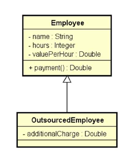

# Employee

Cadastro de trabalhadores próprios e terceirizados, apresentando ao final os valores pagos a cada um deles de acordo com as taxas aplicáveis.
Exercício elaborado no curso de Java do prof. Nelio Alves.

## Tela do Sistema

```text
Enter the number of employees: 3
Employee #1 data:
Outsourced (y/n)? n
Name: Alex
Hours: 50
Value per hour: 20.00
Employee #2 data:
Outsourced (y/n)? y
Name: Bob
Hours: 100
Value per hour: 15.00
Additional charge: 200.00
Employee #3 data:
Outsourced (y/n)? n
Name: Maria
Hours: 60
Value per hour: 20.00

PAYMENTS:
Alex - $ 1000.00
Bob - $ 1720.00
Maria - $ 1200.00
```

## Diagrama


