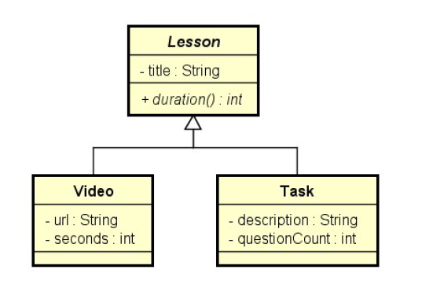

# Lesson

Sistema para cadastro de aulas e tarefas informando a duração total do curso. Para cada questão das tarefas são considerados 5 min de duração. Exercicio realizado no curso do prof. Nelio Alves.

## Tela do Sistema

```text
Quantas aulas tem o curso? 3

Dados da 1a aula:
Conteúdo ou tarefa (c/t)? c
Titulo: Orientação a objetos
URL do vídeo: https://youtu.be/aBh
Duração em segundos: 310

Dados da 2a aula:
Conteúdo ou tarefa (c/t)? c
Titulo: Listas em Java
URL do vídeo: https://youtu.be/e5a
Duração em segundos: 250

Dados da 3a aula:
Conteúdo ou tarefa (c/t)? t
Titulo: Exercício de fixação
Descrição: Faça um programa que imprima uma lista
Quantidade de questões: 2

DURAÇÃO TOTAL DO CURSO = 1160 segundos
```

## Diagrama

Abaixo o diagrama idealizado para o projeto:

