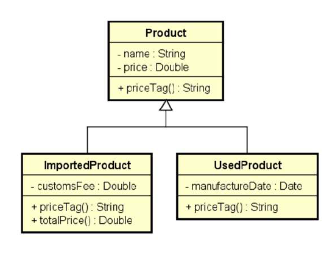

# Product

Cadastro de produtos padrão, importados ou usados. Para cada tipo de produto é emitido uma etiqueta de preços distinta.
Exercício elaborado no curso de Java do prof. Nelio Alves.

## Tela do Sistema

```text
Enter the number of products: 3
Product #1 data:
Common, used or imported (c/u/i)? i
Name: Tablet
Price: 260.00
Customs fee: 20.00
Product #2 data:
Common, used or imported (c/u/i)? c
Name: Notebook
Price: 1100.00
Product #3 data:
Common, used or imported (c/u/i)? u
Name: Iphone
Price: 400.00
Manufacture date (DD/MM/YYYY): 15/03/2017

PRICE TAGS:
Tablet $ 280.00(Customs fee: 20.00)
Notebook $ 1100.00
Iphone (used) $ 400.0 (Manufacture date: 15/03/2017)
```

## Diagrama

