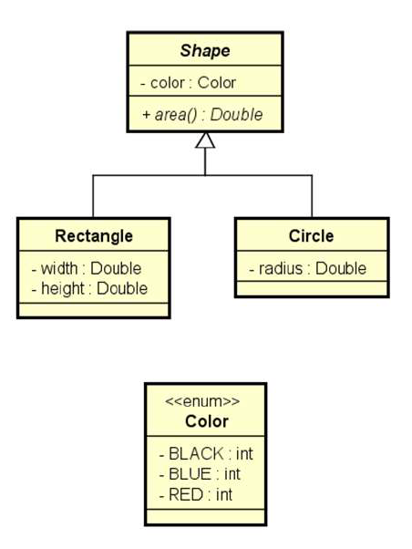

# Shape

Sistema para cálculo da área de formas geométricas. Exercicio realizado no curso do prof. Nelio Alves.

## Tela do Sistema

```text
Enter the number of shapes: 2
Shape #1 data: 
Rectangle or Circle (r/c)? r
Color (BLACK/BLUE/RED): BLACK
Width: 4.0
Height: 5.0
Shape #2 data: 
Rectangle or Circle (r/c)? c
Color (BLACK/BLUE/RED): RED
Radius: 3.0

SHAPE AREAS: 
20.00
28.27
```

## Diagrama

Abaixo o diagrama idealizado para o projeto:

