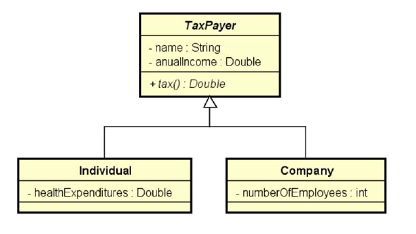

# Tax Payer

Sistema para cálculo fictício de imposto de renda pessoa física e jurídica. Exercicio realizado no curso do prof. Nelio Alves.

## Tela do Sistema

```text
Enter the number of tax payers: 3
Tax payer #1 data:
Individual or company (i/c)? i
Name: Alex
Anual income: 50000.00
Health expenditures: 2000.00
Tax payer #2 data:
Individual or company (i/c)? c
Name: SoftTech
Anual income: 400000.00
Number of employees: 25
Tax payer #3 data:
Individual or company (i/c)? i
Name: Bob
Anual income: 120000.00
Health expenditures: 1000.00

TAXES PAID:
Alex: $ 11500.00
SoftTech: $ 56000.00
Bob: $ 29500.00

TOTAL TAXES: $ 97000.00
```

## Diagrama

Abaixo o diagrama idealizado para o projeto:

