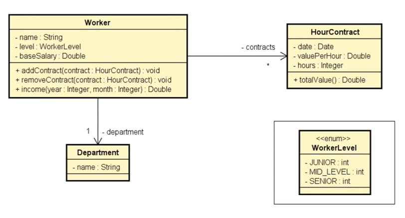

# Worker

Esta aplicação permite registrar informações de trabalhadores, bem como cadastrar os contratos associados a cada um deles.
Exercício elaborado no curso de Java do prof. Nelio Alves.

## Tela do Sistema

```text
Enter department's name: Design
Enter worker data:
Name: Alex
Level: MID_LEVEL
Base salary: 1200.00
How many contracts to this worker? 3
Enter contract #1 data:
Date (DD/MM/YYYY): 20/08/2018
Value per hour: 50.00
Duration (hours): 20
Enter contract #2 data:
Date (DD/MM/YYYY): 13/06/2018
Value per hour: 30.00
Duration (hours): 18
Enter contract #3 data:
Date (DD/MM/YYYY): 25/08/2018
Value per hour: 80.00
Duration (hours): 10

Enter month and year to calculate income (MM/YYYY): 08/2018
Name: Alex
Department: Design
Income for 08/2018: 3000.00
```

## Diagrama


